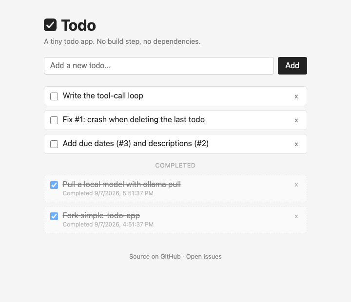

# [simple-todo-app](https://aral.cc/simple-todo-app/?demo)

A minimal todo app. No build step, no dependencies.



## Running locally

Open `index.html` in a browser:

```bash
open index.html
```

Todos are persisted in `localStorage`.

Tests need only Node.js (>= 20). `baseline.test.js` must always pass; each `issue-N.test.js` fails until issue N is fixed.

```bash
npm test
```

## Features

- Add, edit, and delete todo items
- Check off items. Completed items move to the bottom with a timestamp
- Data survives page refreshes
